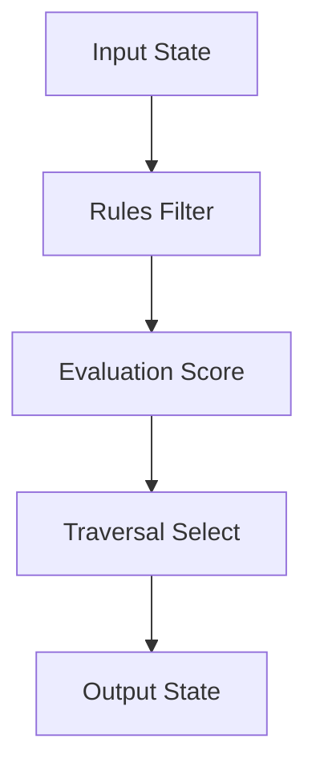

# theHarmonicAlgorithm V3.0 Improvement Opportunities

*Generated during V3.0 module reorganization (2026-01-14)*

This document tracks opportunities for bug fixes, code cleanup, performance optimizations, and new features. Items are categorized by priority and impact.

---

## Priority Matrix

| Priority | Count | Impact Level |
|----------|-------|--------------|
| **Critical** | 0 | System-breaking issues (must fix immediately) |
| **High** | 4 | Significant improvements with clear user benefit |
| **Medium** | 8 | Worthwhile enhancements, moderate complexity |
| **Low** | 11 | Nice-to-have improvements, minimal urgency |

**Total Opportunities**: 23 tracked improvements

---

## Performance Optimizations

### [PO-1] Neo4j Query Batching
**Category**: Database
**Priority**: High
**Impact**: Medium
**Complexity**: Medium

**Description**: Current Query.hs makes individual queries for each chord generation. Could batch queries for multi-chord progressions.

**Current Behavior**:
Each chord generation = 1 database query → network latency accumulates for long progressions

**Proposed**:
- Prefetch N-step lookahead
- Cache candidates in memory
- Batch query for multiple candidates

**Estimated Improvement**: 30-50% faster for progressions >8 chords

**Implementation**:
```haskell
-- In Evaluation.Database.Query
batchQueryCadences :: Neo4jConnection -> [Cadence] -> String -> IO [(Cadence, [Cadence], Double)]
batchQueryCadences conn cadences composer = ...
```

**Related Files**:
- `src/Harmonic/Evaluation/Database/Query.hs`
- `src/Harmonic/Framework/Builder.hs`

---

### [PO-2] Progression Caching
**Category**: Memory
**Priority**: Medium
**Impact**: Low
**Complexity**: Low

**Description**: USER_GUIDE.tidal regenerates progressions frequently with same parameters. Could cache by parameter hash.

**Current Behavior**:
`gen start 4 "*" 0.5 ctx` recomputes each time even with identical parameters

**Proposed**:
Memoization with LRU cache:
```haskell
type ProgCache = Map ProgKey Progression
data ProgKey = ProgKey CadenceState Int String Double HarmonicContext
```

**Estimated Improvement**: Instant for repeated queries (common in live coding)

**Implementation Complexity**: Low - use `Data.Cache` or similar

**Related Files**:
- `src/Harmonic/Framework/Builder.hs`

---

### [PO-3] VoiceLeading DP Optimization
**Category**: Algorithm
**Priority**: Medium
**Impact**: Medium
**Complexity**: High

**Description**: Cyclic DP currently O(n³) for n-voice chords. Could optimize to O(n²) by exploiting chord structure.

**Current Implementation**: `src/Harmonic/Evaluation/Scoring/VoiceLeading.hs` (~120 lines)

**Proposed**:
- Prune voicing candidates based on heuristics
- Use bidirectional search
- Cache intermediate DP states

**Estimated Improvement**: 2-3× faster for 4+ voice chords

**Caveat**: May require sacrificing optimal voice leading in edge cases

**Related Files**:
- `src/Harmonic/Evaluation/Scoring/VoiceLeading.hs`
- `src/Harmonic/Interface/Tidal/Arranger.hs`

---

### [PO-4] Lazy Evaluation for Long Progressions
**Category**: Algorithm
**Priority**: Low
**Impact**: Low
**Complexity**: Medium

**Description**: Progressions are currently strict. Could make generation lazy for very long progressions (>64 chords).

**Current Behavior**: Full progression computed upfront

**Proposed**: Stream progressions lazily:
```haskell
type ProgressionStream = [CadenceState]  -- Infinite list
```

**Benefits**:
- Lower memory for long progressions
- Earlier first-chord latency
- Enables infinite progressions

**Drawbacks**:
- Complicates cyclic voice leading
- More complex error handling

**Related Files**:
- `src/Harmonic/Rules/Types/Progression.hs`
- `src/Harmonic/Framework/Builder.hs`

---

## Code Cleanup

### [CC-1] Builder.hs Splitting
**Category**: Architecture
**Priority**: High
**Impact**: Medium
**Complexity**: Low

**Description**: Builder.hs is 250+ lines mixing orchestration logic with state management.

**Current Structure**: Single module with mixed concerns

**Proposed**:
Extract `Framework/Context.hs` for shared state:
```haskell
module Harmonic.Framework.Context
  ( HarmonicContext
  , harmonicContext
  , defaultContext
  , CadenceState
  , initCadenceState
  ) where
```

Keep `Framework/Builder.hs` for pure orchestration:
```haskell
module Harmonic.Framework.Builder
  ( genSilent
  , genStandard
  , genVerbose
  ) where

import Harmonic.Framework.Context
```

**Benefits**:
- Clearer separation of concerns
- Easier testing of context logic
- Better alignment with R→E→T framework

**Related Files**:
- `src/Harmonic/Framework/Builder.hs` (split into 2 modules)

---

### [CC-2] VoiceLeading.hs Role Clarification
**Category**: Architecture
**Priority**: High
**Impact**: Medium
**Complexity**: Medium

**Description**: VoiceLeading.hs serves two roles: cost calculation (E) and optimization (T).

**Current**: Single module at `Evaluation/Scoring/VoiceLeading.hs` with mixed concerns

**Proposed**:
Split into two modules:

1. `Evaluation/Scoring/VoiceLeading.hs` (cost functions only):
```haskell
module Harmonic.Evaluation.Scoring.VoiceLeading
  ( voiceLeadingCost    -- E: Scoring
  , intervalCost
  , cyclicDistance
  ) where
```

2. `Traversal/VoiceLeading.hs` (optimization only):
```haskell
module Harmonic.Traversal.VoiceLeading
  ( flowVoicing          -- T: Selection strategy
  , rootVoicing
  , optimizeVoiceLeading
  ) where

import Harmonic.Evaluation.Scoring.VoiceLeading (voiceLeadingCost)
```

**Benefits**: Clean R→E→T separation

**Related Files**:
- `src/Harmonic/Evaluation/Scoring/VoiceLeading.hs` (current location)
- `src/Harmonic/Traversal/VoiceLeading.hs` (new module)

---

### [CC-3] Overtone Notation Documentation
**Category**: Documentation
**Priority**: Medium
**Impact**: Low
**Complexity**: Low

**Description**: Overtone syntax (`"E A D G"`, `"C'"`) is underdocumented in module Haddock.

**Current**: Documented in README but not in `Rules/Constraints/Overtone.hs`

**Proposed**: Add comprehensive Haddock with examples:
```haskell
-- | Parse overtone filter notation
--
-- Supported formats:
--
-- * Note names: @"E A D G"@ → Combined overtone series of E, A, D, G
-- * Single note: @"C"@ → C overtone series [0,4,7,10]
-- * Prime notation: @"C'"@ → Exact pitch-class (no overtones)
-- * Mixed: @"G E' A' A#'"@ → G overtones + individual pitches E, A, A#
-- * Wildcard: @"*"@ → All 12 pitch-classes
--
-- Examples:
--
-- >>> parseTuning "E A D G"
-- [0,2,4,5,7,9,10,11]  -- Combined overtones of bass tuning
--
-- >>> parseTuning "C"
-- [0,4,7,10]  -- C overtone series
--
-- >>> parseTuning "G E' A' A#'"
-- [0,2,4,5,7,9,10,11]  -- G overtones + blues notes
```

**Related Files**:
- `src/Harmonic/Rules/Constraints/Overtone.hs`

---

### [CC-4] Filter.hs Simplification
**Category**: Code Quality
**Priority**: Low
**Impact**: Low
**Complexity**: Low

**Description**: Filter.hs has redundant pitch-class set operations. Could use `Data.Set` library for clarity.

**Current**: Manual list intersection/union operations

**Proposed**: Use `Data.Set`:
```haskell
import qualified Data.Set as S

filterPitchSet :: String -> [Int] -> [Int]
filterPitchSet spec pcs =
  let allowed = S.fromList (parseTuning spec)
      existing = S.fromList pcs
   in S.toList (S.intersection allowed existing)
```

**Benefits**:
- Less code
- Clearer intent
- Standard library usage

**Related Files**:
- `src/Harmonic/Rules/Constraints/Filter.hs`

---

### [CC-5] Unified Selection Strategy API
**Category**: Architecture
**Priority**: Low
**Impact**: Medium
**Complexity**: Medium

**Description**: Selection logic scattered in Builder.hs and Probabilistic.hs. Could create unified `Traversal/Selection.hs`.

**Current**: Ad-hoc selection in Builder

**Proposed**: Create `Traversal/Selection.hs`:
```haskell
module Harmonic.Traversal.Selection
  ( SelectionStrategy(..)
  , selectNext
  , selectWeighted
  , selectGreedy
  ) where

data SelectionStrategy
  = Weighted Double      -- Entropy parameter
  | Greedy              -- Always select highest weight
  | Uniform             -- Uniform random

selectNext :: SelectionStrategy -> [(Cadence, Double)] -> IO Cadence
```

**Benefits**:
- Easier to add new strategies
- Clear API for selection
- Better testability

**Related Files**:
- `src/Harmonic/Framework/Builder.hs` (extract from)
- `src/Harmonic/Traversal/Probabilistic.hs`
- `src/Harmonic/Traversal/Selection.hs` (new)

---

## Bug Fixes

### [BF-1] Enharmonic Spelling Consistency
**Category**: Music Theory
**Priority**: Medium
**Impact**: Low
**Complexity**: Medium

**Description**: Some progressions inconsistently spell enharmonics (C# vs Db) depending on intermediate cadence chain.

**Current Behavior**: Spelling depends on path through cadence graph

**Expected**: User-specified `EnharmonicSpelling` should be enforced throughout chain

**Proposed**: Add spelling enforcement in `advanceStateTraced`:
```haskell
advanceStateTraced :: EnharmonicSpelling -> CadenceState -> Movement -> Cadence -> CadenceState
advanceStateTraced forcedSpelling current mvmt cadence =
  -- Force spelling regardless of path
```

**Related Files**:
- `src/Harmonic/Rules/Types/Harmony.hs`
- `src/Harmonic/Framework/Builder.hs`

---

### [BF-2] Composer Weight Edge Case
**Category**: Database
**Priority**: Low
**Impact**: Low
**Complexity**: Low

**Description**: Composer `"*"` with no data returns empty results instead of fallback.

**Current Behavior**: Query.hs returns `[]` if no `"*"` composer exists in Neo4j

**Expected**: Fall back to default distribution or error message

**Proposed**: Add fallback logic in `fetchTransitions`:
```haskell
fetchTransitions conn cadence "*"
  | null results = return defaultDistribution
  | otherwise = return results
```

**Related Files**:
- `src/Harmonic/Evaluation/Database/Query.hs`

---

### [BF-3] Progression Empty Check
**Category**: Error Handling
**Priority**: Low
**Impact**: Low
**Complexity**: Low

**Description**: `arrange` on empty Progression causes pattern match exception.

**Current Behavior**: Runtime error: `*** Exception: Prelude.!!: index too large`

**Expected**: Return empty pattern or clear error message

**Proposed**: Add guard in `arrange`:
```haskell
arrange voiceFunc prog rep register pats
  | progLength prog == 0 = silence
  | otherwise = ...
```

**Related Files**:
- `src/Harmonic/Interface/Tidal/Arranger.hs`

---

## Feature Requests (Future V3.x)

### [FR-1] Composer Specification Implementation
**Category**: Feature
**Priority**: High
**Impact**: High
**Complexity**: High

**Description**: Currently composer parameter is always `"*"`. Implement per-composer filtering.

**Current**: All composers aggregated

**Proposed**:
- Add composer weights to Neo4j queries
- Allow `"bach"`, `"debussy"`, etc. in generation
- Blend multiple composers with ratios: `"bach:70 debussy:30"`

**Implementation Steps**:
1. Update Query.hs to parse composer specifications
2. Modify Neo4j query to filter by composer edge weights
3. Add blending logic for multiple composers
4. Update tests and documentation

**Complexity**: High (requires database schema changes)

**Related Files**:
- `src/Harmonic/Evaluation/Database/Query.hs`
- `src/Harmonic/Framework/Builder.hs`
- `CLAUDE.md` (spec for composer filtering)

---

### [FR-2] Interactive Context Modification
**Category**: Feature
**Priority**: Medium
**Impact**: Medium
**Complexity**: Medium

**Description**: Allow runtime modification of HarmonicContext mid-progression for key modulations.

**Use Case**: Modulate keys or change overtone palette during generation

**Proposed**: Add `modulate` function:
```haskell
modulate :: HarmonicContext -> Progression -> IO Progression
modulate newCtx existingProg = ...
```

**Example**:
```haskell
-- Generate 8 bars in C major
progCMaj <- genSilent start 8 "*" 0.5 (harmonicContext "*" "C" "*")

-- Modulate to G major for next 8 bars
progGMaj <- modulate (harmonicContext "*" "G" "*") progCMaj
```

**Related Files**:
- `src/Harmonic/Framework/Builder.hs`
- `src/Harmonic/Rules/Types/Progression.hs`

---

### [FR-3] Visual Progression Rendering
**Category**: Feature
**Priority**: Low
**Impact**: Low
**Complexity**: High

**Description**: Export progressions as sheet music (LilyPond) or chord diagrams (SVG).

**Use Case**: Share progressions outside TidalCycles environment

**Proposed**: New module `Interface/Export/`:
```haskell
module Harmonic.Interface.Export.LilyPond where

toLilyPond :: Progression -> String
toLilyPond prog = ...

module Harmonic.Interface.Export.SVG where

toChordDiagram :: Progression -> String
toChordDiagram prog = ...
```

**Complexity**: High (requires rendering library integration)

**Related Files**:
- `src/Harmonic/Interface/Export/LilyPond.hs` (new)
- `src/Harmonic/Interface/Export/SVG.hs` (new)

---

### [FR-4] Alternative Database Backends
**Category**: Feature
**Priority**: Low
**Impact**: High
**Complexity**: Very High

**Description**: Support PostgreSQL, SQLite as alternatives to Neo4j.

**Benefits**:
- Easier deployment (no Docker requirement)
- Lower resource usage
- More familiar database for some users

**Proposed**: Abstract database interface:
```haskell
class HarmonicDatabase db where
  queryCadences :: db -> Cadence -> String -> IO [(Cadence, Double)]
  writeGraph :: db -> [Cadence] -> IO ()

instance HarmonicDatabase Neo4jConnection where ...
instance HarmonicDatabase PostgresConnection where ...
instance HarmonicDatabase SqliteConnection where ...
```

**Complexity**: Very High (complete database abstraction)

**Related Files**:
- `src/Harmonic/Evaluation/Database/Query.hs` (abstract)
- `src/Harmonic/Rules/Import/Graph.hs` (abstract)
- New: `src/Harmonic/Evaluation/Database/Backend/*.hs`

---

## Documentation Improvements

### [DI-1] API Reference Generation
**Category**: Documentation
**Priority**: Medium
**Impact**: Medium
**Complexity**: Low

**Description**: No published API documentation. Haddock exists but not hosted.

**Proposed**:
- Add `stack haddock --open` instructions to README
- Host on GitHub Pages
- Link from README.md

**Implementation**:
```bash
# Generate Haddock
stack haddock --haddock-arguments "--odir=docs"

# Commit to gh-pages branch
git checkout gh-pages
cp -r docs/* .
git add .
git commit -m "Update API documentation"
git push
```

**Related Files**:
- All module Haddock comments
- `.github/workflows/haddock.yml` (new CI workflow)

---

### [DI-2] Visual Diagrams
**Category**: Documentation
**Priority**: High
**Impact**: High
**Complexity**: Low

**Description**: ARCHITECTURE.md has ASCII diagrams. Could add Mermaid.js or rendered SVG diagrams.

**Proposed**: Create diagrams for:
1. R→E→T pipeline flow
2. Four-layer vertical architecture
3. Module dependency graph
4. Zero-form invariant visualization
5. Generation pipeline sequence diagram

**Tools**: Mermaid.js (renders in GitHub), or generate SVG with Graphviz

**Example**:


**Related Files**:
- `ARCHITECTURE.md` (update with visual diagrams)
- `docs/diagrams/` (new directory for SVG assets)

---

### [DI-3] Cookbook Examples
**Category**: Documentation
**Priority**: Medium
**Impact**: Medium
**Complexity**: Low

**Description**: No genre-specific progression examples (jazz, classical, modal).

**Proposed**: Add `docs/cookbook/` with musical examples:
- `jazz.md` - ii-V-I progressions, tritone substitutions
- `classical.md` - Common practice period cadences
- `modal.md` - Modal interchange, Dorian/Mixolydian patterns
- `blues.md` - 12-bar blues, blues substitutions

**Example**:
```haskell
-- Jazz ii-V-I in C major
jazzCtx <- harmonicContext "*" "C" "D G C"  -- Filter to ii, V, I roots
start <- initCadenceState 2 "D" [0,3,7,10] FlatSpelling  -- Dm7
prog <- genSilent start 3 "*" 0.3 jazzCtx  -- Low entropy for common patterns
```

**Related Files**:
- `docs/cookbook/*.md` (new documentation)

---

### [DI-4] Video Tutorial
**Category**: Documentation
**Priority**: Low
**Impact**: Medium
**Complexity**: Medium

**Description**: No visual walkthrough for new users.

**Proposed**: Screen recording covering:
1. Installation (Stack, Docker, Neo4j)
2. First progression in GHCi
3. TidalCycles integration
4. Live coding demo

**Duration**: 10-15 minutes

**Tools**: OBS Studio for recording, YouTube for hosting

**Related Files**:
- README.md (link to video)

---

## Testing Improvements

### [TI-1] Property-Based Testing Expansion
**Category**: Testing
**Priority**: Medium
**Impact**: Medium
**Complexity**: Medium

**Description**: Only PitchSpec uses QuickCheck extensively. Could expand to Harmony, VoiceLeading.

**Proposed**: Add `Arbitrary` instances for:
```haskell
instance Arbitrary Chord where
  arbitrary = ...

instance Arbitrary Cadence where
  arbitrary = ...

instance Arbitrary Progression where
  arbitrary = ...
```

Then add property tests:
```haskell
prop_voiceLeadingSymmetric :: Chord -> Chord -> Bool
prop_voiceLeadingSymmetric c1 c2 =
  voiceLeadingCost c1 c2 == voiceLeadingCost c2 c1

prop_progressionMonoid :: Progression -> Progression -> Progression -> Bool
prop_progressionMonoid p1 p2 p3 =
  (p1 <> p2) <> p3 == p1 <> (p2 <> p3)  -- Associativity
```

**Related Files**:
- `test/Harmonic/Rules/Types/HarmonySpec.hs`
- `test/Harmonic/Evaluation/Scoring/VoiceLeadingSpec.hs`
- `test/Harmonic/Rules/Types/ProgressionSpec.hs`

---

### [TI-2] Integration Tests for Neo4j
**Category**: Testing
**Priority**: High
**Impact**: High
**Complexity**: Medium

**Description**: No automated tests for database queries (only unit tests).

**Current**: Tests mock database or skip database-dependent tests

**Proposed**: Docker-based integration tests in CI:
```yaml
# .github/workflows/test.yml
services:
  neo4j:
    image: neo4j:5
    env:
      NEO4J_AUTH: neo4j/password
```

Then add integration test suite:
```haskell
-- test/Integration/Neo4jSpec.hs
describe "Neo4j Integration" $ do
  it "fetches transitions for C major" $ do
    conn <- connect
    results <- fetchTransitions conn cMajorCadence "*"
    length results `shouldSatisfy` (> 0)
```

**Related Files**:
- `test/Integration/Neo4jSpec.hs` (new)
- `.github/workflows/test.yml` (new CI workflow)

---

### [TI-3] TidalCycles Mock Testing
**Category**: Testing
**Priority**: Low
**Impact**: Low
**Complexity**: Medium

**Description**: Interface layer untestable without TidalCycles runtime.

**Current**: Interface tests only verify types, not pattern behavior

**Proposed**: Mock `ControlPattern` for pure function testing:
```haskell
-- test/Harmonic/Interface/Tidal/MockPattern.hs
data MockPattern a = MockPattern [a]

instance Applicative MockPattern where ...
instance Monad MockPattern where ...

-- Then test interface functions with mock
testHarmony = harmony testProg (MockPattern [0,1,2,3])
```

**Related Files**:
- `test/Harmonic/Interface/Tidal/BridgeSpec.hs`
- `test/Harmonic/Interface/Tidal/MockPattern.hs` (new)

---

## Implementation Sequence (Recommended)

### Phase 1: Quick Wins (1-2 days)
- [DI-2] Visual diagrams for ARCHITECTURE.md
- [CC-3] Overtone notation Haddock
- [BF-2] Composer fallback logic
- [CC-4] Filter.hs simplification

### Phase 2: Architecture Improvements (2-3 days)
- [CC-1] Extract Context.hs from Builder.hs
- [CC-2] Split VoiceLeading.hs (E vs T)
- [CC-5] Unified Selection API
- [PO-2] Progression caching

### Phase 3: Performance (3-5 days)
- [PO-1] Neo4j query batching
- [PO-3] VoiceLeading DP optimization
- [TI-2] Neo4j integration tests

### Phase 4: Features (1-2 weeks)
- [FR-1] Composer specification implementation
- [FR-2] Interactive context modification
- [DI-3] Cookbook examples
- [DI-1] API reference hosting

### Phase 5: Polish (Ongoing)
- [DI-4] Video tutorial
- [TI-1] Property-based testing expansion
- [FR-3] Visual rendering (LilyPond/SVG)

---

## Version History

- **V3.0.0** (2026-01-14): Module reorganization complete, improvements identified
- **V3.1.0** (Planned): Quick wins + architecture improvements
- **V3.2.0** (Planned): Performance optimizations + integration tests
- **V4.0.0** (Future): Composer specification + major features

---

**Document Maintenance**: Update this file when improvements are implemented or new opportunities are discovered.

**Last Updated**: 2026-01-14
**Status**: Active tracking for V3.0 → V3.x development
