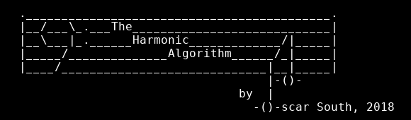
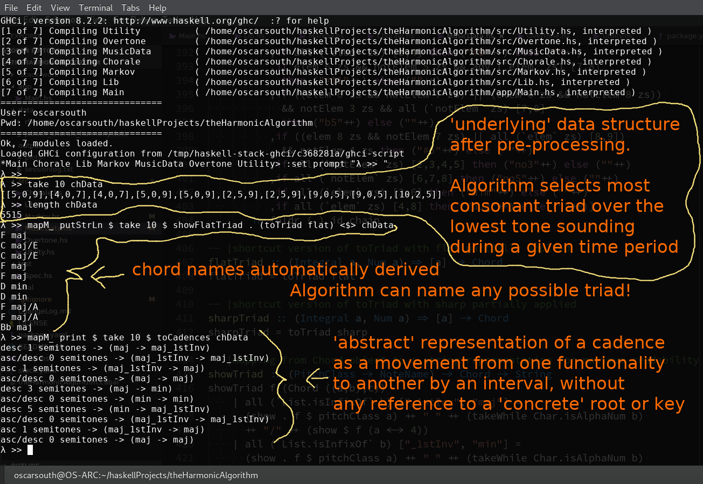
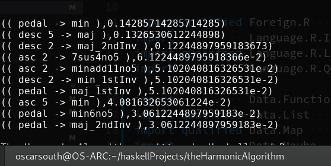

# The Harmonic Algorithm

The Harmonic Algorithm, written in Haskell and R, generates musical domain 
specific data inside user defined constraints then filters it down and 
deterministically ranks it using a tailored Markov Chain model trained on 
ingested musical data. This presents a unique tool in the hands of the 
composer or performer which can be used as a writing aid, analysis 
device or even in live performance. 

The project spans Machine Learning, Functional Programming and Musical 
Analysis and has encompassed my MA Thesis in Music and HDip Science In 
Data Analytics Capstone as well as countless hours of personal research, 
musicological analysis and software development.

Here's a screenshot of the output from playing around with a few higher 
level functions in the MusicData module:

Here's a view of the 'raw' data returned by the trained model:

In this case, it's returning the top 10 ranked 'next' harmonic movements
following a perfect cadence (with the dominant in first inversion).

Keep checking back and don't hesitate to get in touch via this 
repository's 'Issues' section, or the contact form for my main 
performance project here: [UDAGANuniverse.com/contact](https://www.UDAGANuniverse.com/contact)

Oscar