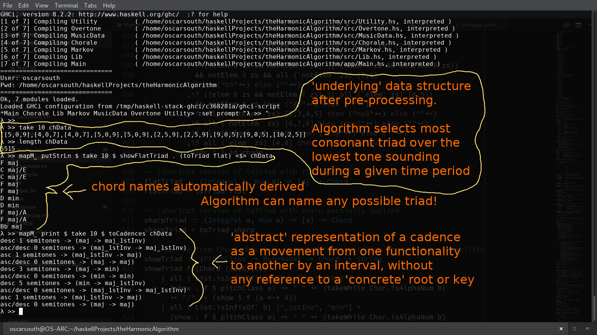

# theHarmonicAlgorithm

Hello!
I've noticed that this repo is starting to pick up a few stars and forks.
It's still a work in progress but I'm making big strides in development.

It's going to be very cool! When I get it operational I'll provide some
more in depth installation and usage instructions as well as practical
musical examples of use cases. Wait until you see what this thing can do!

Here's a screenshot of the output from playing around with a few higher 
level functions in the MusicData module:

Keep checking back and don't hesitate to get in touch via this 
repositories 'Issues' section, or the contact form here:
[UDAGANuniverse.com!](https://www.UDAGANuniverse.com)

Oscar