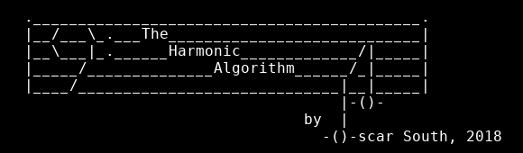

# The Harmonic Algorithm

> *"My music of today is so much based on the new musical technology. We use the technology as a material for our musical art"*
> — Igor Stravinsky, 1957



___
### Welcome to The Harmonic Algorithm :)
###### this is an expression of my musical mind — it feels kind of like an 'LLM' (but there's no AI here, just old school counting and music theory) for navigating through and interacting with musical harmonic state in real time, while experiencing it.
___

The Harmonic Algorithm, written in Haskell, using Neo4j as a backend
and integrated highly with TidalCycles, generates musical domain
specific data inside user defined constraints then filters it down and
probabilistically ranks it using a tailored Markov Chain model trained on
ingested musical data from the Yale Classical Archives Corpus. This presents
a unique tool in the hands of the composer or performer which can be used
as a writing aid, analysis device, for instrumental study or even in live
performance.

This open-source project is based on a long term research agenda that I've
pursued for many years, originating from an interest as an electric bass player
in performance and composition, utilising the overtones of the instrument.

The Harmonic Algorithm takes the underpinning theoretical ideas from this
research and realises them as a Haskell library with deep TidalCycles
integration for live coding. Under the hood, harmonic transitions from over
80 composers are stored in a Neo4j graph database. The system learns how
harmony moves — not just what chords exist, but how they lead into one
another — and uses this knowledge to generate progressions that feel
musically coherent while remaining endlessly surprising.

The core idea draws on Geraint Wiggins' Creative Systems Framework: define
the *rules* of what's harmonically possible, *evaluate* the quality of each
option using voice leading and dissonance scoring, then *traverse* the space
probabilistically — balancing between the familiar and the unexpected.

The project is built around three principles:

- **The Harmonic Algorithm** — the generative engine. An R→E→T pipeline
  that produces harmonic progressions from learned transition probabilities,
  originating in a 2016 exhaustive overtone analysis and realised
  computationally in Haskell with Neo4j as the graph backend.

- **Algorithmic Orchestration** — the performance paradigm. Musical elements
  are abstracted into harmony (contexts and generation), form (the spectral
  narrative), and interfaces (instrument timbres and voice lines), enabling
  live-coded orchestral scoring via TidalCycles.

- **The Spectral Narrative** — the structural framework. Macro-level
  compositional arc encoded as programmable kinetics signals in wall-clock
  time, carrying continuous intensity and dynamics envelopes that drive
  instrument activation, voice density, and harmonic switching.

<!-- [video: 60-second overview — generating a progression from a single chord,
hearing it come to life through TidalCycles and SuperCollider, the harmony
unfolding in real time as patterns evolve and layer] -->

___

## Research

The original 2016 research documents on which The Harmonic Algorithm draws
influence can be accessed at the following links:

Core document:
[original core document (2016)](documents/The_Harmonic_Algorithm_2016.pdf)

Reflective document:
[original reflective document (2016)](documents/Harmonic_Algorithm_Reflections_2016.pdf)

The accompanying document for this project which discusses The Harmonic Algorithm
as a creative system can be accessed here:
[creative system document (2018)](documents/Data_Science_In_The_Creative_Process_2018.pdf)

___

## What It Sounds Like

The same starting chord can lead to radically different musical outcomes.
A single parameter — entropy — controls the balance between familiar harmonic
motion and surprising, exploratory leaps:

<!-- [audio: low entropy (0.2) — smooth, conventional voice leading] -->
<!-- [audio: high entropy (0.8) — unexpected turns, distant modulations] -->

The system also lets you blend the harmonic sensibilities of different composers.
These aren't presets — they're weighted combinations of learned transition
probabilities:

<!-- [audio: "bach" — strong functional harmony, clear cadential motion] -->
<!-- [audio: "debussy" — colourful, modal inflections] -->
<!-- [audio: "bach:30 debussy:70" — functional foundations with impressionistic colour] -->
<!-- [video: live coding session — building a piece from scratch in TidalCycles] -->

___

## What It Looks Like

Let's start simple. Here's what it looks like to generate your first
progression — just a starting chord, a length, and an entropy value:

<!-- [gif: launching stack ghci, generating an 8-chord progression from C major] -->

Now let's apply some constraints. The Harmonic Algorithm lets you filter
by key signature, overtone series, and root motion — narrowing the
harmonic possibilities to match your musical context:

<!-- [gif: applying key/overtone filters, watching choices narrow] -->

Things get interesting when you bring this into TidalCycles. The library
integrates directly — generated progressions become patterns you can
manipulate, voice, and perform live:

<!-- [gif: TidalCycles — arrange transforms a progression into layered patterns] -->

You don't always need the algorithm to generate for you. Sometimes you
want to build progressions by hand — the changes to a standard, a
specific harmonic idea — and use the library's voicing and arrangement
tools to bring them to life:

<!-- [gif: explicit chord construction with note names, arranged through TidalCycles] -->

And here's the composer blending in action — switching between learned
styles and hearing how the same harmonic starting point leads to
completely different musical journeys:

<!-- [gif: composer blending — "bach", "debussy", weighted blend side by side] -->

___

## Installation

### Dependencies

1. [Haskell Stack](https://docs.haskellstack.org/en/latest/install_and_upgrade/)
2. [Docker](https://www.docker.com/) (for the Neo4j graph database)
3. [TidalCycles](https://tidalcycles.org/) (optional — for live coding integration)

Once dependencies have been installed, the following steps can be used to
build and run:

### Setup

```bash
# Clone the repository
git clone https://github.com/OscarSouth/theHarmonicAlgorithm
cd theHarmonicAlgorithm

# Build the library
stack build

# Start the Neo4j database
docker compose up -d neo4j

# Populate the database with the YCACL corpus
stack run

# Verify everything works
stack test
```

You can now start exploring with `stack ghci` or integrate with TidalCycles
using the boot file in `live/BootTidal.hs`.

___

## Going Deeper

Once you're up and running, there's plenty to explore:

**[User Guide](USER_GUIDE.md)** — complete feature reference, readable
without a running TidalCycles environment.

**[Interactive User Guide](live/USER_GUIDE.tidal)** — the same guide as a
hands-on tutorial with examples you can run directly in TidalCycles.

**[Worked Examples](live/examples/)** — complete pieces you can play with
immediately, including a jazz standard arrangement and a traditional tune
with form transformation.

**[Algorithmic Orchestration](ALGORITHMIC_ORCHESTRATION.md)** — scoring for
a virtual orchestra: instrument catalogue, voice lines, sections, blends,
and the subKick groove interface.

**[Architecture Guide](ARCHITECTURE.md)** — the technical deep dive into
how the system works: the four-layer architecture, the R→E→T pipeline,
zero-form cadence storage, and the graph database model.

**[Changelog](CHANGELOG.md)** — V3 features and migration notes.

**[Contributor Guidelines](CLAUDE.md)** — for anyone who'd like to
contribute: the vertical slice workflow, mandatory verification steps,
and layer boundary rules.

___

## Acknowledgments

This project wouldn't exist without the work of:

- **Geraint A. Wiggins** — the Creative Systems Framework that underpins
  the algorithm's architecture
- **Alex McLean** — TidalCycles, which gave this project its voice
- **Paul Hindemith** — interval dissonance theory from The Craft of Musical
  Composition (1937), which informs the evaluation scoring
- **UCI Machine Learning Repository** — the Yale Classical Archives Corpus
  that trains the model

___

Let me know if you have any feature suggestions or comments in general and
feel free to get in touch through this repository's
[Issues](https://github.com/OscarSouth/theHarmonicAlgorithm/issues) section.

Alternatively, use the contact form for my main performance project UDAGAN:
https://UDAGANuniverse.com/contact

Oscar

___

MIT License — see [LICENSE](LICENSE) for details.
