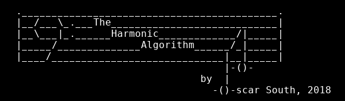

# The Harmonic Algorithm

> *"My music of today is so much based on the new musical technology. We use the technology as a material for our musical art"*
> — Igor Stravinsky, 1957



[](https://github.com/OscarSouth/theHarmonicAlgorithm/actions/workflows/ci.yml)
[](https://docs.theharmonicalgorithm.com/)
[](LICENSE)
[](https://buymeacoffee.com/oscarsouth)

___
### Welcome to The Harmonic Algorithm :)
###### this is an expression of my musical mind — it feels kind of like an 'LLM' (but there's no AI here, just old school counting and music theory) for navigating through and interacting with musical harmonic state in real time, while experiencing it.
___

The Harmonic Algorithm, written in Haskell, using Neo4j as a backend
and integrated highly with TidalCycles, generates musical domain
specific data inside user defined constraints then filters it down and
probabilistically ranks it using a tailored Markov Chain model trained on
ingested musical data from the Yale Classical Archives Corpus. This presents
a unique tool in the hands of the composer or performer which can be used
as a writing aid, analysis device, for instrumental study or even in live
performance.

This open-source project is based on a long term research agenda that I've
pursued for many years, originating from an interest as an electric bass player
in performance and composition, utilising the overtones of the instrument.

The Harmonic Algorithm takes the underpinning theoretical ideas from this
research and realises them as a Haskell library with deep TidalCycles
integration for live coding. Under the hood, harmonic transitions from over
488 composers are stored in a Neo4j graph database. The system learns how
harmony moves — not just what chords exist, but how they lead into one
another — and uses this knowledge to generate progressions that feel
musically coherent while remaining endlessly surprising.

The core idea draws on Geraint Wiggins' Creative Systems Framework: define
the *rules* of what's harmonically possible, *evaluate* the quality of each
option using corpus statistics and dissonance scoring, then *traverse* the
space probabilistically — balancing between the familiar and the unexpected.

The project is built around four principles:

- **The Harmonic Algorithm** — the generative engine. An R→E→T pipeline
  that produces harmonic progressions from learned transition probabilities,
  originating in a 2016 exhaustive overtone analysis and realised
  computationally in Haskell with Neo4j as the graph backend.

- **Algorithmic Orchestration** — the performance paradigm. Musical elements
  are abstracted into harmony (contexts and generation), form (the spectral
  narrative), and interfaces (instrument timbres, voice lines, and divisi),
  enabling live-coded orchestral scoring via TidalCycles.

- **The Spectral Narrative** — the structural framework. Macro-level
  compositional arc encoded as programmable kinetics signals over wall-clock
  seconds or bars, with smooth or snap transitions, carrying continuous
  intensity and dynamics envelopes that drive instrument activation, voice
  density, and harmonic switching.

- **Octatripentatonics** — the harmonic-organisation research frontier.
  Every progression carries its harmony in three densities at once —
  chords, pentatonics and modes: genP walks them through a curated space
  of interlocking five-note scales, and every gen / genJ result derives
  them by chordscale key-area analysis. It's my own ongoing thread of
  music theory, grown out of the system and now feeding back into it
  ([OCTATRIPENTATONICS.md](documents/OCTATRIPENTATONICS.md),
  [CHORDSCALE.md](documents/CHORDSCALE.md)).

The system has grown into a genuinely performable instrument along the
way. Mid-piece, I can regenerate just the two bars that aren't working and
keep everything else; ask for a dozen candidate progressions and have the
best one picked for me; or bring in a walking bassline that follows the
changes like a duet partner. All of it live, all of it code.

> ### ▶ VIDEO — The whole thing in miniature
> _~60s: lead "C maj" → seek "*" → a launcher on one piano channel; layer
> an hcPedal constraint, then wrap it in a kinetics arc with two gated
> voices rising and falling over ~45 seconds._
>
> `[ youtube link — TBD ]`

___

## Research

The original 2016 research documents on which The Harmonic Algorithm draws
influence can be accessed at the following links:

Core document:
[original core document (2016)](documents/The_Harmonic_Algorithm_2016.pdf)

Reflective document:
[original reflective document (2016)](documents/Harmonic_Algorithm_Reflections_2016.pdf)

The accompanying document for this project which discusses The Harmonic Algorithm
as a creative system can be accessed here:
[creative system document (2018)](documents/Data_Science_In_The_Creative_Process_2018.pdf)

___

## What It Sounds Like

The same starting chord can lead to radically different musical outcomes.
A single parameter — entropy — controls the balance between familiar harmonic
motion and surprising, exploratory leaps:

> ### ▶ VIDEO — Entropy, heard
> _~30s: the same starting state at entropy 0.2 (smooth, conventional,
> close cadences) and 0.8 (unexpected turns, distant modulations)._
>
> `[ youtube link — TBD ]`

The system also lets you blend the harmonic sensibilities of different composers.
These aren't presets — they're weighted combinations of learned transition
probabilities:

> ### ▶ VIDEO — Composer blending, heard
> _~40s: seek "bach" (functional harmony, clear cadences), seek "debussy"
> (colour, modal inflections), then "bach:30 debussy:70" — functional
> foundations wearing impressionistic colour._
>
> `[ youtube link — TBD ]`

(And if you can't run Docker right now: `seek "none"` bypasses the graph
entirely — progressions shaped by your context filters and entropy alone.)

> ### ▶ VIDEO — Building a piece, live
> _~90s: a live coding session assembled section by section from the User
> Guide — starting state → context with hcPedal → generation → launcher →
> a second arrange voice → a multi-node kinetics form, the full arc rising
> and falling on a single piano channel._
>
> `[ youtube link — TBD ]`

___

## What It Looks Like

Let's start simple. Here's what it looks like to generate your first
progression — just a starting chord, a length, and an entropy value:

> ### ▶ VIDEO — First generation
> _~15s: User Guide §1 in the TidalCycles editor — `start <- lead "C maj"`,
> then `s <- seek "*" $ cue start $ len 8 $ entropy 0.5 $ gen'`, the
> diagnostics printing bar by bar with candidate pools visible._
>
> `[ youtube link — TBD ]`

Now let's apply some constraints. The Harmonic Algorithm lets you filter
by key signature, overtone palette, and root motion — narrowing the
harmonic possibilities to match your musical context:

> ### ▶ VIDEO — Narrowing the space
> _~20s: User Guide §4 — layering hcKey "0#", then hcPedal "C", then
> consonant onto hContext, re-running gen' after each. The candidate pools
> shrink visibly as the constraints tighten._
>
> `[ youtube link — TBD ]`

Things get interesting when you bring this into TidalCycles. The library
integrates directly — generated progressions become patterns you can
manipulate, voice, and perform live:

> ### ▶ VIDEO — Patterns meet harmony
> _~20s: User Guide §9 — the same progression and pattern under arrange,
> then arrange', then with overlapF 2: pattern-across-chords vs
> pattern-within-chords vs natural legato sustain._
>
> `[ youtube link — TBD ]`

You don't always need the algorithm to generate for you. Sometimes you
want to build progressions by hand — the changes to a standard, a
specific harmonic idea — and use the library's voicing and arrangement
tools to bring them to life:

> ### ▶ VIDEO — By hand
> _~15s: User Guide §11 — `prog (notesToPCs <$> [[C,E,G], [F,A,C],
> [G,B,D], [A,C,E]])`, launched through the same launcher as the
> generated examples._
>
> `[ youtube link — TBD ]`

And here's the composer blending in action — switching between learned
styles and hearing how the same harmonic starting point leads to
completely different musical journeys:

> ### ▶ VIDEO — Blends, on screen
> _~20s: User Guide §5 — one context and cue state under seek "bach",
> "debussy", and "bach:30 debussy:70", each audible; the gen' header
> showing the composer string and, for blends, the portmanteau name._
>
> `[ youtube link — TBD ]`

___

## Installation

There are two ways in. The first needs nothing but the repository and
makes sound straight away; the second adds the composer corpus.

### Dependencies

1. [Haskell Stack](https://docs.haskellstack.org/en/latest/install_and_upgrade/)
   with **GHC 9.10.3** installed and set as default (e.g. via
   [ghcup](https://www.haskell.org/ghcup/)) — `stack.yaml` sets
   `system-ghc: true`, so Stack uses your system GHC rather than
   downloading its own
2. [TidalCycles](https://tidalcycles.org/) with SuperCollider + SuperDirt —
   any editor will do; [`LIVE_ENVIRONMENT.md`](documents/LIVE_ENVIRONMENT.md)
   documents the Pulsar rig this project is performed on, as one worked example
3. [Docker](https://www.docker.com/) — only for the composer graph (second path)

### 1. Start here — no database required

```bash
git clone https://github.com/OscarSouth/theHarmonicAlgorithm
cd theHarmonicAlgorithm

stack build      # compile the library
stack test       # verify everything works
```

Boot TidalCycles with `live/BootTidal.hs` and you're playing. Generation
runs on the built-in consonance fallback — pass `"none"` as the composer
string and everything in the guides works, shaped by your own filters and
entropy:

```haskell
start <- lead "C maj"
s <- seek "none" $ cue start $ len 4 $ entropy 0.5 $ gen
```

You can also explore in the REPL with `stack ghci`.

### 2. Add the composer graph

The graph holds harmonic transitions learned from 488 composers. Start
Neo4j, then load the pre-built database published with the
[latest release](https://github.com/OscarSouth/theHarmonicAlgorithm/releases):

```bash
# download the graph (98MB) and its checksum
curl -LO https://github.com/OscarSouth/theHarmonicAlgorithm/releases/download/corpus-v3/ycacl-graph.dump
curl -L https://github.com/OscarSouth/theHarmonicAlgorithm/releases/download/corpus-v3/SHA256SUMS | shasum -a 256 -c

# load it (the database must be offline), then start Neo4j
docker compose stop neo4j
docker run --rm -i -v "$PWD/neo4j/data:/data" neo4j:5.26 \
  neo4j-admin database load neo4j --from-stdin --overwrite-destination < ycacl-graph.dump
docker compose up -d neo4j
```

Every `seek` string then works: `"bach"`, `"debussy"`,
`"bach:30 debussy:70"`, `"*"`.

<details>
<summary>Rebuilding the graph from source (advanced)</summary>

`stack run` populates Neo4j from `data/artefacts/ycacl_sequences.csv`, which is not
distributed with the repository. To produce it, obtain the Yale Classical
Archives Corpus yourself (see [NOTICES.md](NOTICES.md) for provenance) and run
the export helper documented in `scripts/README.md`:

```bash
Rscript scripts/export_ycacl.R <YCACL dir> <metadata csv> data/artefacts/ycacl_sequences.csv
stack run
```
</details>

___

## Going Deeper

Once you're up and running, there's plenty to explore:

**[User Guide](USER_GUIDE.md)** — the full walkthrough in readable form,
video slots and all, no running TidalCycles environment required.

**[Interactive User Guide](live/USER_GUIDE.tidal)** — the same guide as a
hands-on tutorial with examples you can run directly in TidalCycles.

**[Octatripentatonics](documents/OCTATRIPENTATONICS.md)** — the theory frontier:
strata, tristrata, and the three-layer harmony system, in full.

**[Polytonal](documents/POLYTONAL.md)** — the genE framework: a foundation
walk plus two partner triad chains, the overlap algebra behind the layer
selectors, and the viability study the design rests on.

**[Chordscale](documents/CHORDSCALE.md)** — key-area analysis for gen and
genJ: the composite-minor key lattice, the mode and pentatonic layer
derivation, and the walking-bass unification.

**[Algorithmic Orchestration](documents/ALGORITHMIC_ORCHESTRATION.md)** — scoring for
a virtual orchestra: instrument catalogue, voice lines, divisi, sections,
blends, and the subKick groove interface.

**[The Live Environment](documents/LIVE_ENVIRONMENT.md)** — the editor, boot
and SuperCollider rig the project is performed on: Pulsar configuration, the
compiled-session wrapper, MIDI routing, and the failure modes worth recognising.

**[API Reference](https://docs.theharmonicalgorithm.com/)** — generated Haddock
documentation for all 50 modules, with worked examples on every user-facing
entry point. Start at `Harmonic.Lib`.

**[Architecture Guide](documents/ARCHITECTURE.md)** — the technical deep dive into
how the system works: the four-layer architecture, the R→E→T pipeline,
zero-form cadence storage, and the graph database model.

**[Data Modelling](documents/DATA_MODELLING.md)** — how corpus harmony becomes
the cadence graph: zero-form abstraction, weighted interpretation, and
consistent-path transition counting.

**[Composer Catalogue](documents/COMPOSERS.md)** — every composer key in the
graph and the query syntax for names and blends.

**[Changelog](CHANGELOG.md)** — V3 features and migration notes.

**[The original demo (V1, 2018–19)](documents/LEGACY_V1_DEMO.md)** — a piece of
history: the interactive terminal app this grew out of, walkthrough and
animations preserved.

___

## Acknowledgments

This project wouldn't exist without the work of:

- **Geraint A. Wiggins** — the Creative Systems Framework that underpins
  the algorithm's architecture
- **Alex McLean** — TidalCycles, which gave this project its voice
- **Paul Hindemith** — interval dissonance theory from The Craft of Musical
  Composition (1937), which informs the evaluation scoring
- **UCI Machine Learning Repository** — the Yale Classical Archives Corpus
  that trains the classical model
- **Carey Bunks** — the Jazz-Chord-Progressions-Corpus (ISMIR 2023) that
  trains the jazz model; full citation in [NOTICES.md](NOTICES.md)

___

Let me know if you have any feature suggestions or comments in general and
feel free to get in touch through this repository's
[Issues](https://github.com/OscarSouth/theHarmonicAlgorithm/issues) section.

Alternatively, come hang out or contact me through the forum 
for my main performance project UDAGAN:
https://forum.UDAGAN.uk/

If the project is useful to you and you'd like to help keep the research going,
you can [buy me a coffee](https://buymeacoffee.com/oscarsouth) — or use the
**Sponsor** button at the top of this page. A star is free and helps just as much.

Oscar

___

BSD 3-Clause License — see [LICENSE](LICENSE) for details.
