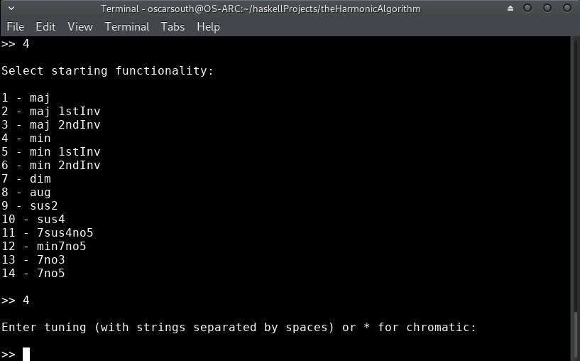

# The Harmonic Algorithm

The Harmonic Algorithm, written in Haskell and R, generates musical domain 
specific data inside user defined constraints then filters it down and 
deterministically ranks it using a tailored Markov Chain model trained on 
ingested musical data. This presents a unique tool in the hands of the 
composer or performer which can be used as a writing aid, analysis 
device, for instrumental study or even in live performance. 

This open-source project is based on a long term research agenda that I've
pursued for many years, originating from an interest as an electric bass player
in performance and composition utilising the overtones of the instrument.

The Harmonic Algorithm takes the underpinning theoretical ideas from this 
research and realises them in a Command Line Interface. The Harmonic Algorithm
is not just useful for electric bass players, but can be utilised by 
composers and performers on or for any instrument.

The original 2016 research documents on which The Harmonic Algorithm (2018) draws 
influence can be accessed at the following links:

Core document:
[original core document (2016)](documents/The_Harmonic_Algorithm_2016.pdf)

Reflective document:
[original reflective document (2016)](documents/Harmonic_Algorithm_Reflections_2016.pdf)

The accompanying document for this 2018 project which discusses The Harmonic Algorithm
as a creative system can be accessed here:
[creative system document (2018)](documents/Data_Science_In_The_Creative_Process_2018.pdf)

## Command Line Interface Installation Instructions
### Dependencies

1. Haskell Stack Tool (https://docs.haskellstack.org/en/latest/install_and_upgrade/)
2. R Interpreter (https://cran.r-project.org/)
3. TidyVerse packages for R (from inside R, execute the command 
`install.packages("tidyverse")`)

Once dependencies have been installed, the following steps can be used to
build the executable:

### Installation
1. Clone with git (recommended) or download and unzip the Harmonic Algorithm 
repository from GitHub. To clone with git, make sure that git is installed on 
your system and execute `git clone https://github.com/OscarSouth/theHarmonicAlgorithm` 
in the desired location.
2. In a terminal or command prompt, navigate to the Harmonic Algorithm directory.
3. Run the following command from inside the Harmonic Algorithm directory:
`stack --install-ghc build`

You can now run The Harmonic Algorithm by executing the following command from
inside it's directory:
`stack exec theHarmonicAlgorithm-exe`

## Usage Guide

Initially on loading the app, the R interpreter will be booted and required
libraries loaded. The Harmonic Algorithm is written primarily in Haskell and
interfaces with the R statistical computation language for enhanced dataframe 
manipulation and plotting functionality:

After a moment, the title screen will load and you will be asked a couple of
multiple choice questions relating to what enharmonic (flat or sharp) notation
style you would prefer to begin with as well as which root note and upper 
musical structure will be chosen as the initial state.

In this example, flat notation with the starting chord of Eb minor is chosen:

The next selections are related to how the list of 'next' harmonic choices
will be filtered down. These can be modified at any time during interactive
usage of the app.

1. Filtering by overtones or pitch set. This filter will limit possible harmonic
   choices to those existing inside a set of pitches. This could represent the
   available overtones of an instrument or a superimposed pitchclass set.
   To derive overtones of a tuning, simply type the fundamental pitches 
   seperated by spaces (eg. `E A D G` for standard electric bass). To add 
   individual pitches, append the 'prime' (`'`) symbol. Overtones and 
   individual pitchclasses can be combined freely (eg. the E minor blues scale 
   consisting of the overtones of a G and additional pitches E, A & A#: 
   `G E' A' A#'`).
  **for most uses cases where simple filtering by key or root notes is required,
    it is best to enter `*` for this filter.

2. Filtering by key. This filter will remove any items from the overtones/
   pitch class set which are not present in the key specified.
   Define this filter by by entering a key signature (`bb`, `###`, `4b`, `0#`).
   or alternatively a key can be named (`C`, `F#m`, `Bb`).
  **where modifying the specified pitchclass set is undesired, enter `*`. 

3. Filtering by root notes. This filter will limit the bass note of harmonic 
   choices to a set of pitch classes or key. Define this filter by entering a 
   set of pitches seperated by spaces (`E F# G`) or a key signature (`1b`, `#`).
  **note that this filter exists independently of filtering by pitch class set
    and key and can (intentially) cause stuctures with root notes outside the
    limits of the upper structure filters to be displayed. To strictly limit by
    a key, enter the same key signature as entered for the key filter.

Results can also be left unfiltered by entering the wild card `*` symbol for all
filters. In this case, all filters are left open:

After taking a few moments to train the recommendation model, the initial list 
of 'next' harmonic choices is displayed along with a few additional options.
The possibilities presented are ranked on a combination of learned behavior 
from the J.S.Bach Chorale harmonisations used to train the model as well as
derived dissonance ranking. The model takes prescidence where there is conflict.

The first ranking would be assuming that our current chord is acting as a iii
in the key of B. Let's remain in Ebm for now. I've chosen option 7 of Db/F
(a VII in Eb voiced in first inversion):

The recommentation system will suggest unique possibilties after each cadence,
depending deterministically on recent harmonic motions. It is also possible to 
remain on the same chord, which is itself a decision and will thus influence
recommendations for the next successive movements.

Let's continue with option 1 for an upwards root motion to the III chord (Gb):

Let's maintain the ascending root motion, this time chromatically. In order to
see what possibilities are available, I'll filter down the results to show 
only structures with a G in the bass while keeping the upper tones chromatic:

This gives us some interesting options! Let's modulate! I'm going to choose
option 6 and think of it as a v chord (in first inversion) in A minor:

The previous minor v is a weak chord to modulate from, however we're
starting to build tension through root motion. Let's modify our filters
and see if there is an interesting choice with an upper structure in the key 
of A minor that will let us continue our chromatic root motion through G#:

I'd also prefer to read this in sharp enharmonic notation, so I'll switch over:

Wow! Some very interesting choices here! The obvious choice would be E/G#, 
representing a V in first inversion leading into the tonic of Am. This seems 
too obvious though. Let's go with G# diminished to really build tension as we
ascend into the new key:

We know we want to modulate to an A root, so we need to modify the filters. 
Since there's already a strong harmonic pull from G# diminished to an A, 
lets just set all filters to `*` and see what the algorithm recommends:

Cool! A minor and A major are our top two recommendations! J.S.Bach really
knew what he was doing! 

Let's diverge from minor keys and resolve to the major. I'll filter down to 
diatonic recommendations inside A major and move into the major tonic through a 
sus4 to add a little ambiguity to the transition:

We're now in the new key and have a variety of choices for where to go next!

## Random Sequences

New in Version 1.0.1.0 is the ability to generate Random Sequences of harmonic
movement!

Random sequences allow the performer/composer to traverse deterministic space 
(move through musical cadences!) at a much faster rate and give a 'higher up' 
viewpoint to the character and nature of harmonic motion in a given musical 
context. The performer/composer can then 'jump in' to any point of the
generated sequence and move through musical space in 'blocks' of harmony.

Let me know if you have any feature suggestions or comments in general and
feel free to get in touch through this repository's 'Issues' section:  https://github.com/OscarSouth/theHarmonicAlgorithm/issues

Alternatively, use the contact form for my main performance project 'UDAGAN':
https://UDAGANuniverse.com/contact

Oscar