# The Harmonic Algorithm — the original interactive demo (V1, 2018–19)

> A piece of history. Before V3 became a live coding instrument, The
> Harmonic Algorithm was an interactive terminal application: you gave it
> a starting chord and some filters, and it offered you ranked harmonic
> choices, one cadence at a time. This page preserves the walkthrough
> from the original README, animations and all.
>
> None of it runs any more — V3 is a complete rebuild, and the CLI is
> gone. The ideas underneath it are all still here though, which is the
> interesting part: the filters became [`HarmonicContext`](../USER_GUIDE.md#4-shape-the-generation-harmoniccontext),
> the ranked choice list became the candidate pool you can still see in
> `gen'` diagnostics, and the Markov model trained on Bach chorales grew
> into the 80-composer graph. Where the old app asked you to pick from a
> list, V3 samples that same ranked space with an entropy dial.

___

## Loading

The app booted an embedded R interpreter for dataframe manipulation and
plotting — the Haskell/R hybrid was very much of its moment:

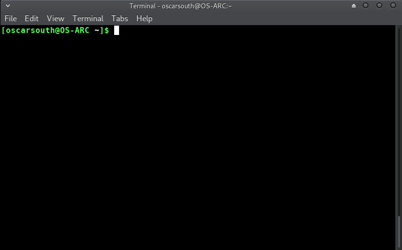

## Choosing a starting point

After the title screen you were asked for an enharmonic preference
(flats or sharps) and a starting chord. Here: flat notation, starting
from E♭ minor.

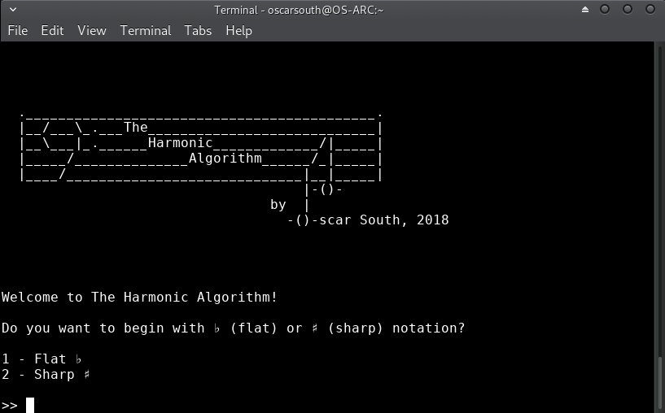

## The three filters

The next selections narrowed the list of "next" harmonic choices. These
could be modified at any point during a session — the ancestors of
today's `hcOvertones`, `hcKey` and `hcRoots`.

1. **By overtones or pitch set.** Limited choices to pitches inside a
   set — the available overtones of an instrument, or a superimposed
   pitch-class set. Fundamentals were entered separated by spaces
   (`E A D G` for standard bass); individual pitches took the prime
   suffix (`G E' A' A#'` — the overtones of G plus E, A and A♯, giving
   an E minor blues scale). `*` left it open.
2. **By key.** Removed anything from that set not present in the key.
   Entered as a signature (`bb`, `###`, `4b`, `0#`) or a name (`C`,
   `F#m`, `Bb`).
3. **By root notes.** Limited the bass note of each choice to a set of
   pitch classes or a key — deliberately independent of the upper
   structure filters, so you could ask for bass motion outside the
   harmonic set.

With all three left open:

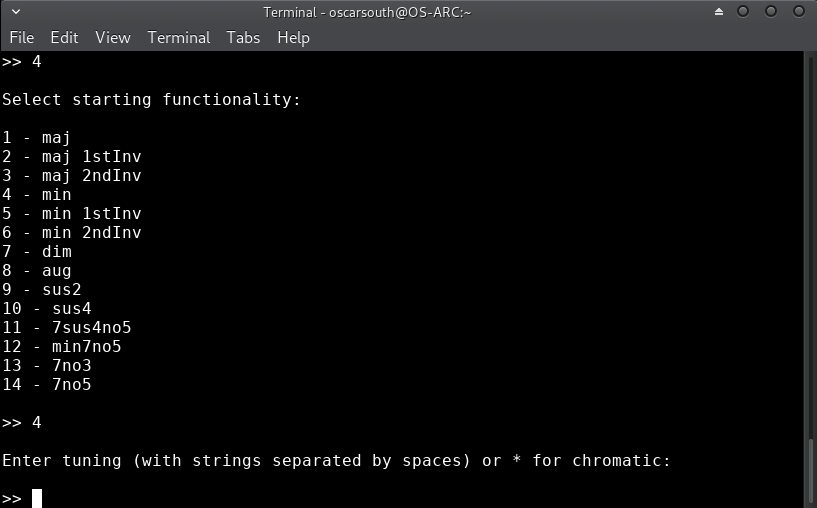

## Moving through harmony, one choice at a time

After a moment training the recommendation model, the ranked list
appeared. Possibilities were ranked on learned behaviour from the J.S.
Bach chorale harmonisations plus derived dissonance ranking — the model
taking precedence where the two disagreed.

The top suggestion treated the current chord as a iii in B. Staying in
E♭ minor instead, option 7 — D♭/F, a ♭VII in first inversion:

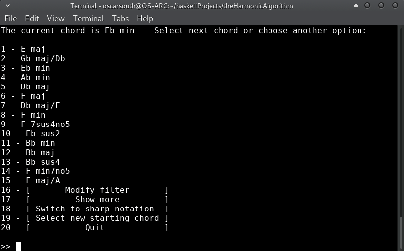

Recommendations were deterministic on recent harmonic motion, so each
cadence produced a fresh set. Remaining on the same chord was itself a
choice, and influenced what came next. Option 1 here, an upward root
motion to the III chord (G♭):

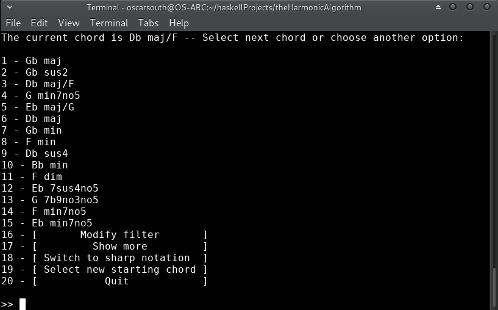

To keep the root motion ascending — this time chromatically — the
filters were narrowed to structures with G in the bass, upper tones left
chromatic:

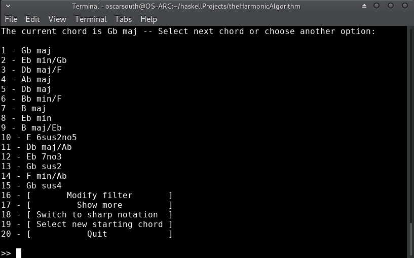

Option 6, heard as a v chord in first inversion in A minor. A
modulation:

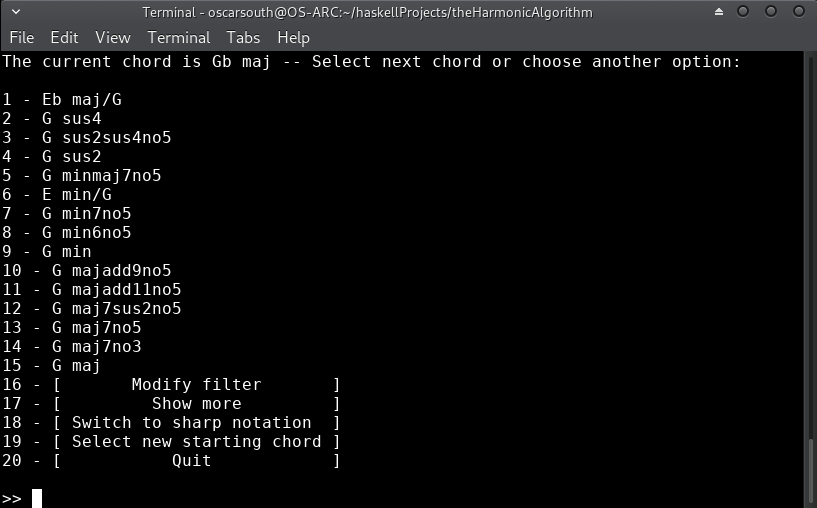

A minor v is a weak chord to modulate from, but the root motion was
building tension. Filters modified to look for an upper structure in A
minor that would continue the chromatic ascent through G♯:

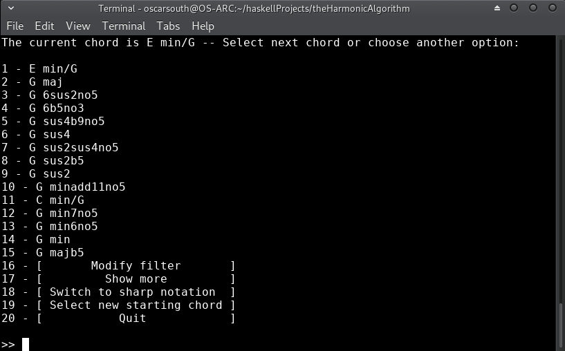

Switching to sharp notation to read it more comfortably:

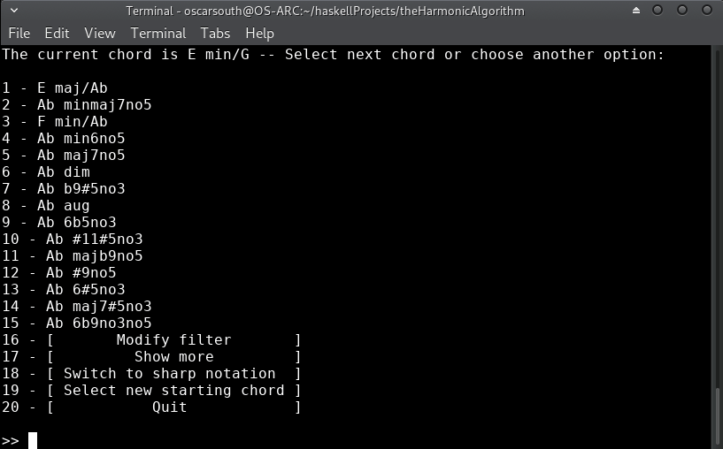

The obvious choice was E/G♯ — a V in first inversion leading to the
tonic of A minor. Too obvious. G♯ diminished instead, to build tension
into the new key:

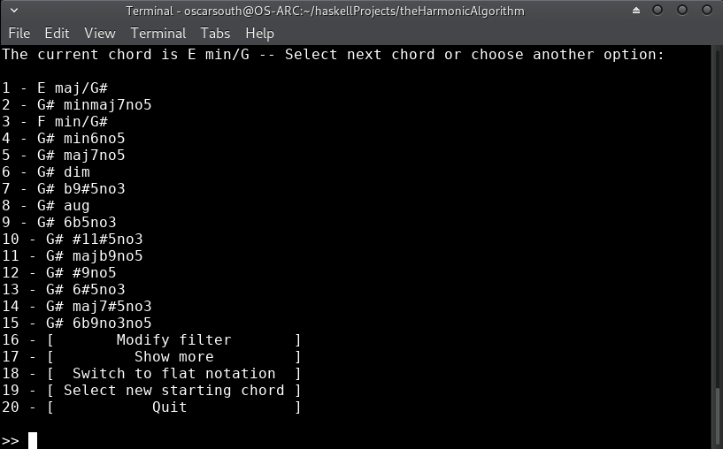

Knowing an A root was wanted, and with a strong pull already present
from G♯ diminished, all filters were opened to see what the algorithm
would suggest:

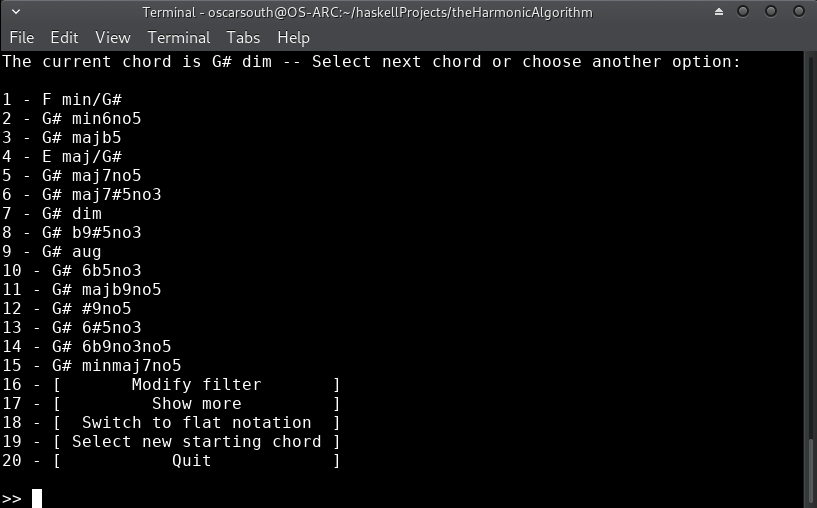

A minor and A major came back as the top two recommendations. Bach knew
what he was doing.

Diverging to the major instead, filtered to diatonic recommendations in
A major, moving into the tonic through a sus4 for a little ambiguity:

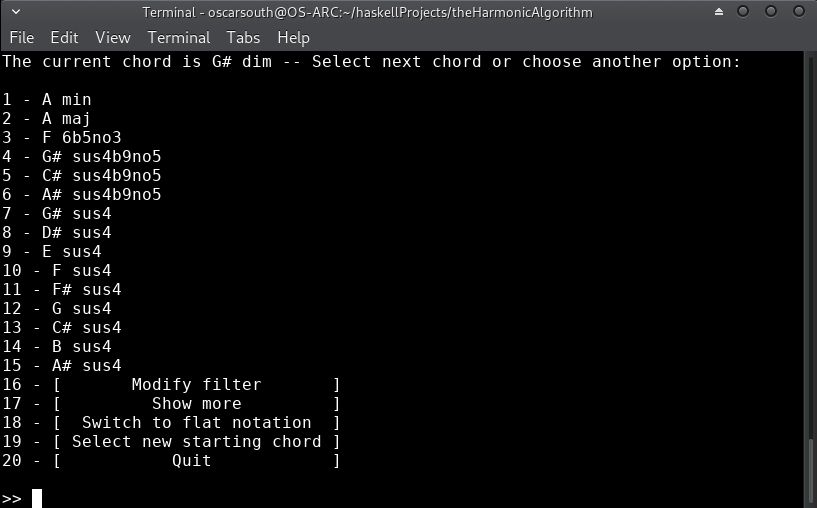

## Random sequences

Version 1.0.1.0 added generated sequences of harmonic movement — a way
to traverse the deterministic space quickly and get a higher-up view of
the character of harmonic motion in a given context, then "jump in" at
any point and move through it in blocks.

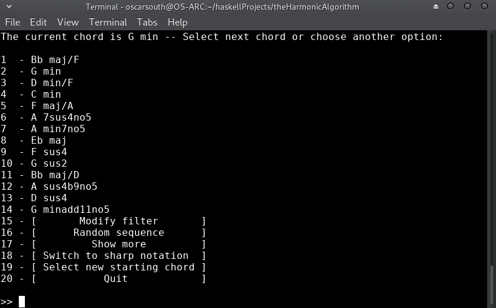

This is the direct ancestor of V3's generation: the same ranked space,
traversed automatically rather than chosen from. What was a novelty
feature became the centre of the instrument.

___

For what any of this turned into, start at the [README](../README.md) or
the [User Guide](../USER_GUIDE.md).
